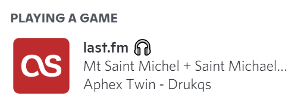

# disclfmpresence

This is a python script to set your Discord rich presence as your currently playing
last.fm track.

## Config

Check the `Config` class in [presence.py](./disclfmpresence/__init__.py) for all supported
config keys.

## Running (poetry)

1. [Install poetry](https://python-poetry.org/docs/#installation);
2. Install dependencies: `poetry install`;
3. Rename `config.toml.example` to `config.toml` and fill with your details
   (check the `Config` class in [presence.py](./presence.py) for all supported
   config keys);
4. Run `poetry run dlfm`. 
   The script should connect to yo:wur running Discord instance and display your playing tracks.